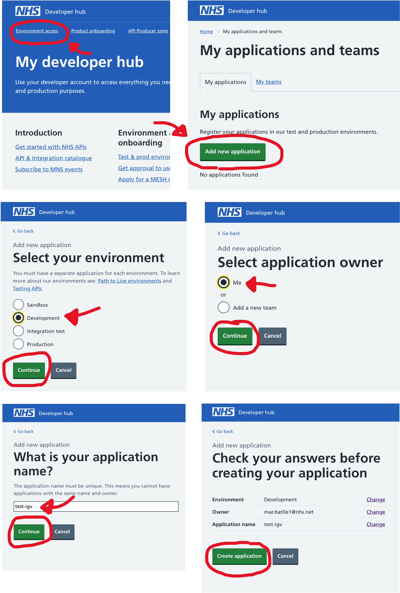
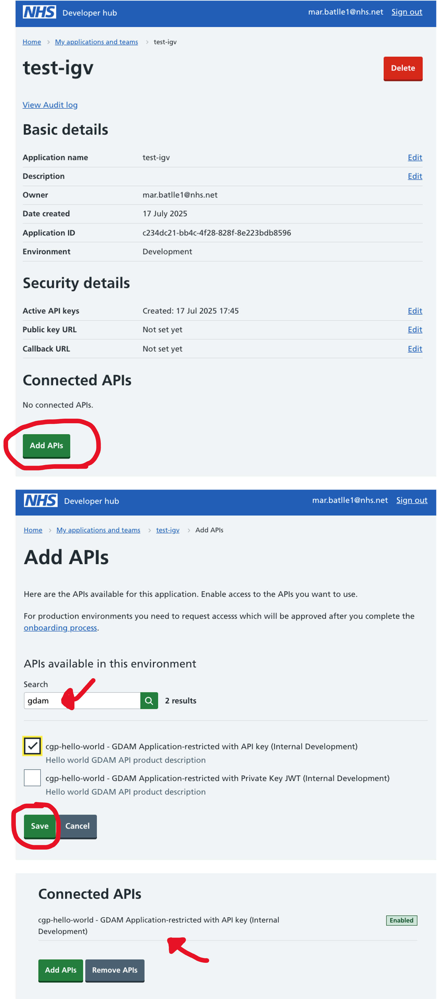
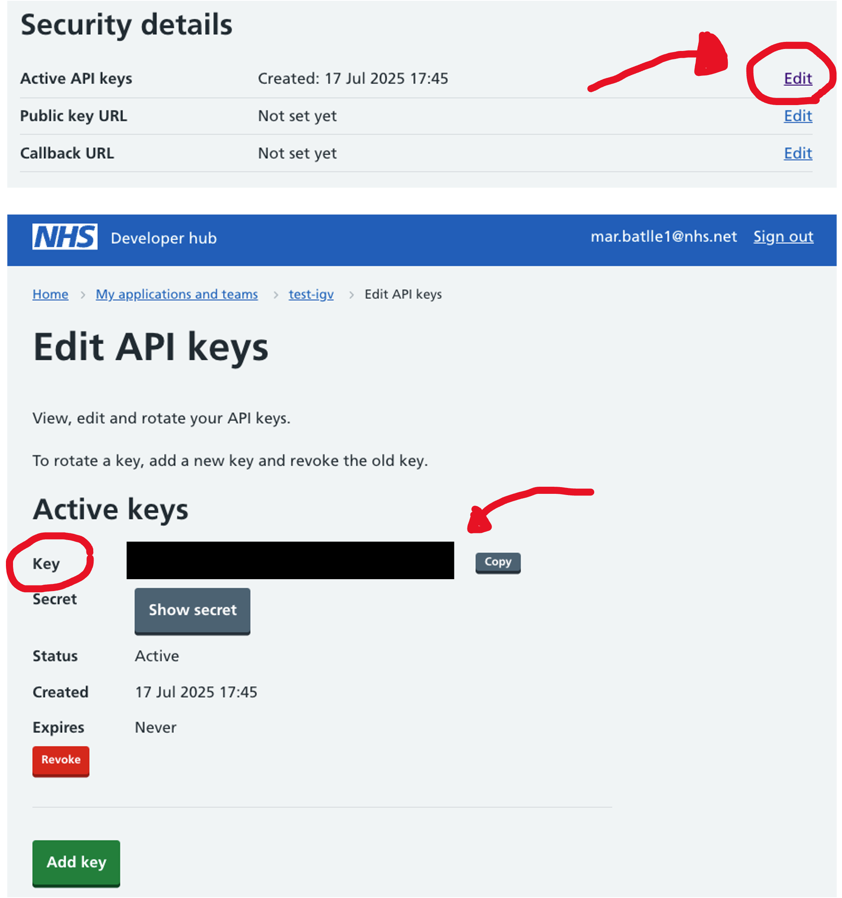

# Visualising Genomic Data with IGV.js Workshop

## About This Workshop

This workshop teaches you how to use the CGPClient library to stream Whole Genome Sequencing (WGS) genomic data files from the Genomics Medicine Service (GMS) through the HTSGET protocol and visualize them with IGV.js.

**Learning Objectives**

By the end of this workshop, you will be able to:

- Set up authentication with the NHS API Platform (APIM)
- Use the CGPClient library to discover and access genomic data files
- Stream WGS genomic data (BAM, CRAM, VCF) via HTSGET protocol
- Integrate genomic data with IGV.js for visualization

**Key Technologies**

- **[HTSGET](https://samtools.github.io/hts-specs/htsget.html)**: A protocol for fast, indexed access to genomic data over HTTP. Instead of downloading entire files, it streams only specific genomic regions, dramatically reducing bandwidth and improving performance.
- **[IGV (Integrative Genomics Viewer)](https://igv.org/)**: The web-based version of the widely-used Integrative Genomics Viewer, enabling Clinical Scientists to quality check variants, examine read alignments, and make informed clinical decisions directly in the browser.

## Environment Setup

### 1. Clone and Set Up CGPClient

Clone the repository and navigate to the project directory:

```bash
git clone https://github.com/NHS-NGS/cgpclient
cd cgpclient
```

Create and activate a Python environment (using conda):

```bash
# Create and activate environment
conda create --name=cgpclient python=3.13
conda activate cgpclient
```

!!! gel-magnify "Environment Management"
    The environment only needs to be set up once and can be reused across multiple workshop sessions.

### 2. Install Dependencies

Install Poetry for dependency management:

```bash
pip install poetry
```

Install the client library and dependencies:

```bash
poetry install
```

### 3. Verify Installation

Test that everything is installed correctly:

```bash
python -c "import cgpclient; print('CGPClient installed successfully')"
```

If you encounter errors, ensure you're in the correct conda environment and that all dependencies were installed properly.


## Authentication Setup

The NHS API Platform uses JWT (JSON Web Token) authentication with API keys. You'll need to register your application and obtain three key pieces of information: API Key, Private Key PEM, and APIM KID.

!!! info "Authentication Reference"
    For detailed authentication methods and troubleshooting, see the [Authentication Guide](../set_up/auth.md)

### Step 1: Register in the NHS API Platform

1. Navigate to the NHS Developer Hub: [https://dos-internal.ptl.api.platform.nhs.uk/](https://dos-internal.ptl.api.platform.nhs.uk/)
2. **Log in** with your NHS.net email address or create an account

### Step 2: Create Your Application

1. Go to **Environment access** → **My applications and teams**
2. Click **Add new application**
3. Fill in your application details:
   - **Environment**: Select 'Development' (for this workshop)
   - **Owner**: Select 'Me'
   - **Name**: Choose a descriptive name (e.g., "test-igv-workshop")
4. Click **Create Application**



### Step 3: Connect the GDAM API

1. In your application dashboard, find the **Connected APIs** section
2. Click **Add APIs**
3. Search for "GDAM API" and select the version that explicitly mentions **API key authentication**
4. Click **Add** to connect the API to your application

You should now see the linked API in your application dashboard.



### Step 4: Generate Your API Key and Private Key

#### Get Your API Key (KID)
1. In your application dashboard, select **Active API keys**
2. Copy your **Key** - this is your KID (Key Identifier)



#### Generate Your Private Key
Use the CGPClient script to generate the required keys:

```bash
cgpclient/scripts/create_apim_keys.sh -k YOUR_API_KEY -d ~/.cgpclient/test-1.pem
```

Replace `YOUR_API_KEY` with the key you copied from the NHS Developer Hub.

**Expected output:**
```bash
Output directory '{private_key_pem}' does not exist. Creating it...
Generating RSA private key, 4096 bit long modulus (2 primes)
...
Key pair and JWKS JSON created successfully for KID: {YOUR_API_KEY} in directory: ~/.cgpclient/
```

### Step 5: Configure CGPClient

Create the configuration directory and file:

```bash
mkdir -p ~/.cgpclient
nano ~/.cgpclient/config.yaml
```

Add the following configuration (replace the placeholder values):

```yaml
api_host: internal-dev.api.service.nhs.uk 
api_name: genomic-data-access
api_key: YOUR_API_KEY_HERE  # API key from the NHS Developer Hub
private_key_pem: /absolute/path/to/test-1.pem # Path to your private key
apim_kid: test-1  # Key ID (KID) associated with the key pair
output_dir: /tmp/output  # Directory for output files
verbose: true  # Enable verbose logging
pretty_print: true  # Format output for readability
```

## Discovering Available Genomic Files

### Using the CGPClient to List Files

List files for a specific referral

cgpclient/scripts/list_files --referral_id r30000000001


this is getting data directly from cnfig file, if you used another location, define it as   -cfg CONFIG_FILE, --config_file CONFIG_FILE
                        Configuration YAML file (default ~/.cgpclient/config.yaml)

cgpclient/scripts/list_files \
--referral_id r30000000001 \
--api_host sandbox.api.service.nhs.uk \
--api_name genomic-data-access \
--api_key $API_KEY
```

### Understanding the Output

The script returns detailed information about each genomic file:

```bash
last_updated            ngis_category           content_type                    size    author_ods_code         referral_id        participant_id          sample_id               run_id          name
2025-07-07T14:03:28     BigWig                  application/bigwig                      8J834                   r30000000001       p12345678301            LP1000000-DNA_B05                       LP1000000-DNA_B05.GRCh38DecoyAltHLA_NonN_Regions_autosomes_sex_mt.CHR_full_res.bw
2025-07-07T14:03:28     index                   application/octet-stream                8J834                   r30000000001       p12345678301            LP1000000-DNA_B05                       LP1000000-DNA_B05.repeats.vcf.gz.tbi
2025-07-07T14:03:28     index                   application/octet-stream                8J834                   r30000000001       p12345678301            LP1000000-DNA_B05                       LP1000000-DNA_B05.cram.crai
2025-07-07T14:03:28     VCF_SV_CNV              application/vcf                         8J834                   r30000000001       p12345678301            LP1000000-DNA_B05                       LP1000000-DNA_B05.enhanced.cnv.vcf.gz
2025-07-07T14:03:28     VCF_SV_CNV              application/vcf                         8J834                   r30000000001       p12345678303            LP1000000-DNA_B07                       LP1000000-DNA_B07.cnv.vcf.gz
2025-07-07T14:03:28     VCF_small               application/vcf                         8J834                   r30000000001       p12345678301            LP1000000-DNA_B05                       r30000000001_0011_LP1000000-DNA_B05.vcf.gz
2025-07-07T14:03:28     index                   application/octet-stream                8J834                   r30000000001       p12345678302            LP1000000-DNA_E11                       LP1000000-DNA_E11.cnv.vcf.gz.tbi
2025-07-07T14:03:28     VCF_SV_CNV              application/vcf                         8J834                   r30000000001       p12345678302            LP1000000-DNA_E11                       LP1000000-DNA_E11.cnv.vcf.gz
2025-07-07T14:03:28     VCF_SV                  application/vcf                         8J834                   r30000000001       p12345678301            LP1000000-DNA_B05                       LP1000000-DNA_B05.repeats.vcf.gz
2025-07-07T14:03:28     CRAM                    application/cram                        8J834                   r30000000001       p12345678302            LP1000000-DNA_E11                       LP1000000-DNA_E11.cram
2025-07-07T14:03:28     index                   application/octet-stream                8J834                   r30000000001       p12345678301            LP1000000-DNA_B05                       LP1000000-DNA_B05.enhanced.cnv.vcf.gz.tbi                                                |

```

## Streaming Data to IGV.js

### Get the HTSGET URL


### Using the HTSget url in IGV.js to get sequencing reads for our cram file


docs: https://cnfl.extge.co.uk/display/CD/GDAM%3A+API+Tutorial